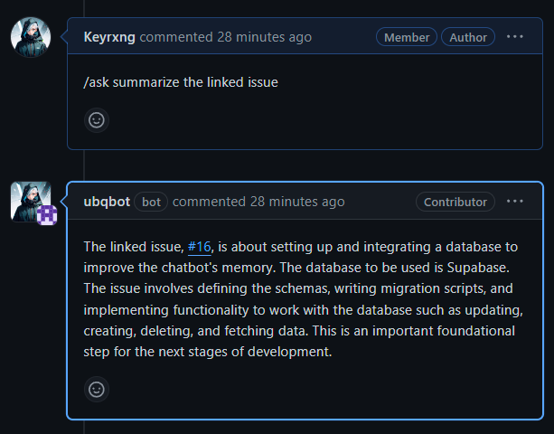

# `@ubiquibot-plugins/research`

This plugin integrates OpenAi's GPT-4 into any issue or pull_request in a repository where your Ubiquibot is installed. It allows you to ask questions and get answers from the GPT-4 model.

## Usage

To use this plugin, an end user must invoke the `/research` command. Any text following the command will be considered the question context for the LLM. In addition to the direct question context, the LLM is provided with all conversational context from the current issue/pull_request as well as any linked issues/pull_requests. This enables a highly context aware response from the LLM.



## [Configuration](/src/plugin-config.yml)

To configure your Ubiquibot to run this plugin, add the following to your [`.ubiquibot-config.yml`](./.github/.ubiquibot-config.yml) file at either the organization or repository level:

```yaml
plugins:
  issue_comment.created:
    - uses:
        - plugin: ubiquibot-plugins/ubiquibot-ask-plugin:compute.yml@development
          name: Research
          id: research-command
          type: github
          description: "Access a highly context-aware GPT-4 embedded directly into your issues and pull requests."
          command: "/research"
          example: "/research The spec for this issue is unclear. Can you explain it in simpler terms?"
          with:
            keys:
              openAi: ""
            disabledCommands: []
```
