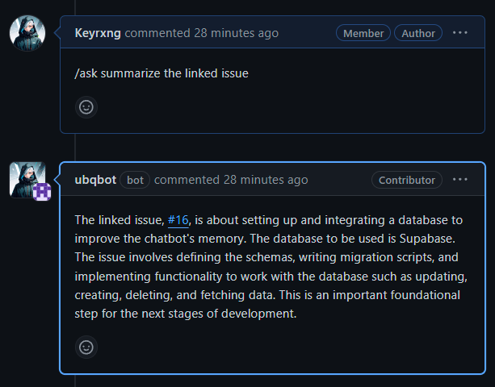

# `@ubiquibot/ask-plugin`

- The purpose of this module is to isolate the ``/ask`` command from the rest of the bot.
- This module is a plugin for the [Ubiquibot](https://github.com/ubiquibot)

### Abilities
- This module can be used to ask GPT-3.5-turbo questions on an issue or pull request where the bot is installed.
- It will parse any linked issues or prs from within the body of the issue or pull request and use that as context for the question.
- It can be used to summarize discussions, provide insight into issues such as expanding or breaking down the specification or requirements, or to provide a summary of the current state of the issue or pull request.

### Usage on an issue or pull request



### Usage within the kernel

```ts
import { GitHubContext } from "../../github-context";
import { ask } from "@ubiquibot/ask-plugin";

export async function issueCommentCreated(event: GitHubContext<"issue_comment.created">) {
  if (event.payload.comment.user.type === "Bot") {
    console.log("Skipping bot comment");
    return null;
  }

  if (event.payload.comment.body.startsWith(`/ask`)) {
    const resp = await ask(event);

    return await event.octokit.issues.createComment({
      owner: event.payload.repository.owner.login,
      repo: event.payload.repository.name,
      issue_number: event.payload.issue.number,
      body: resp,
    });
  }

  await event.octokit.issues.createComment({
    owner: event.payload.repository.owner.login,
    repo: event.payload.repository.name,
    issue_number: event.payload.issue.number,
    body: "Hello from the worker!",
  });
}
```